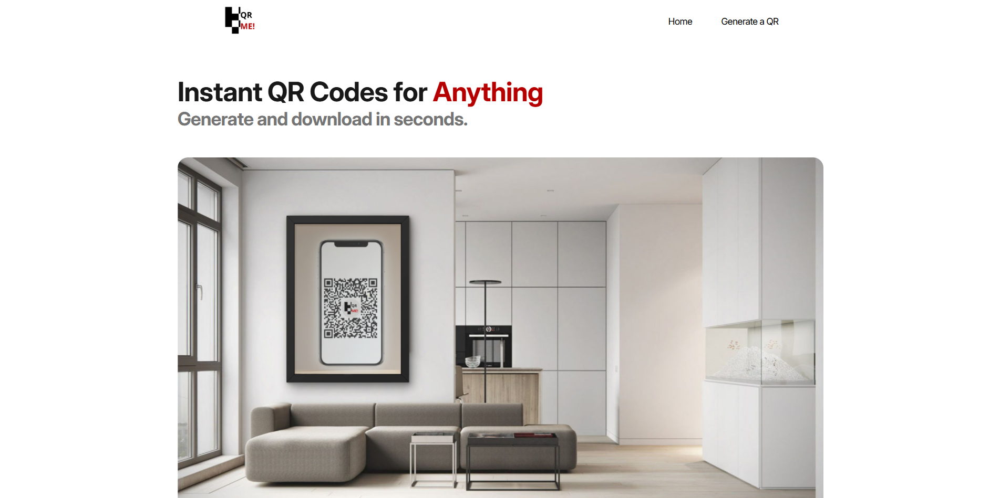

# QR ME! – Instant QR Code Generator

  


**Generate beautiful, downloadable QR codes in seconds.**  
No signup • No limits • No ads

[Live Demo](https://qrmeapp.vercel.app) | [Generate QR](/https://qrmeapp.vercel.app/app)

---

## Features

- Instant QR generation – Type and get your code
- Download as PNG – High-quality export
- Responsive design – Works on mobile & desktop
- Clean, modern UI – Built with love
- No tracking – Your data stays private

---

## Tech Stack

| Tech        | Version   |
|-------------|-----------|
| Vue 3       | `^3.4.0`  |
| Vite        | `^5.0.0`  |
| Vue Router  | `^4.2.0`  |
| Sass (SCSS) | `^1.70.0` |

---

## Project Structure
src/
├── views/          # Pages (Home, QR Generator)
├── router/         # Vue Router config
├── assets/         # Images, icons
├── styles/         # Global SCSS
└── components/     # Reusable components

---

## Quick Start

```bash
# Clone the repo
git clone https://github.com/faazdy/qr-gen-app.git
cd qr-gen-app

# Install dependencies
npm install

# Start dev server
npm run dev
Open http://localhost:5173

```
---

## Available Scripts 
```bash
npm run dev        # Start development server
npm run build      # Build for production
npm run preview    # Preview production build
npm run lint       # Run ESLint
```